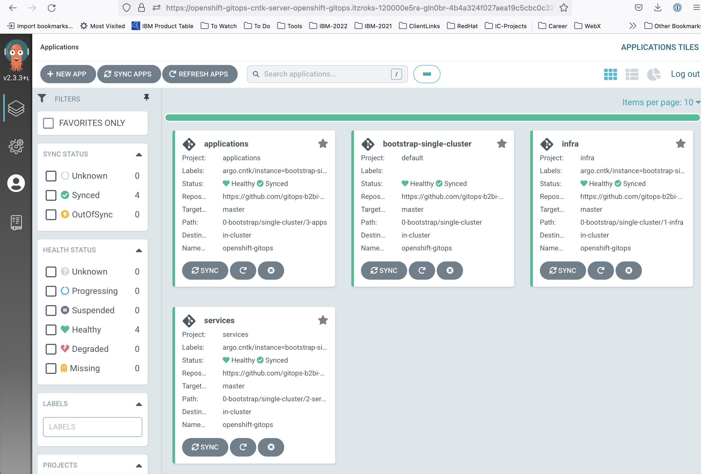
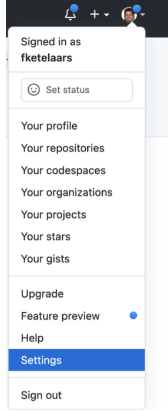
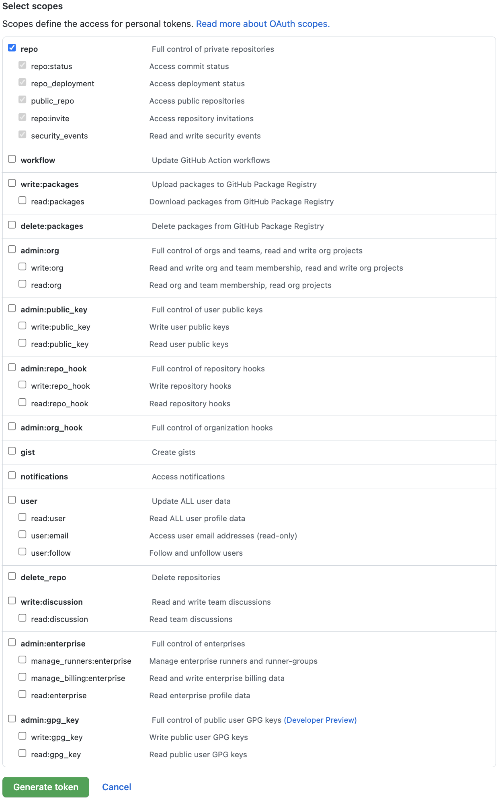
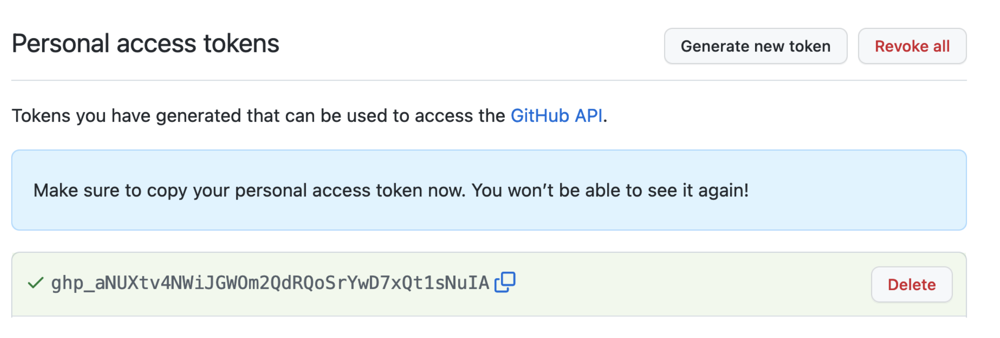
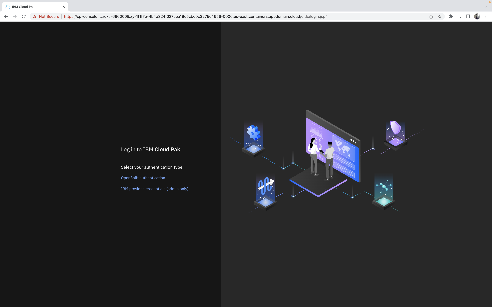

# GitOps Workshop Guide for **MQ on CP4I**

## Overview  

<!--- cSpell:ignore gitorg YAMLs -->

The GitOps concept originated from [Weaveworks](https://www.weave.works/) back in 2017 and the goal was to automate the operations of a Kubernetes (K8s) system using a model external to the system as the source of truth ([History of GitOps](https://www.weave.works/blog/the-history-of-gitops)).

There are various GitOps structure and workflows.  This is our opinionated point of view (PoV) on how `GitOps` can be used to manage the infrastructure, services and application layers of K8s based systems.  It takes into account the various personas interacting with the system and accounts for separation of duties.

In this workshop you will learn the following: 
-   Overview of IBM's GitOps structure and workflow.  During the presentation in part one of the workshop, the instructors will present the overview of IBM's GitOps structure and workflow.  The information that is covered can be found in the [IBM GitOps Deployment Production guide](https://production-gitops.dev/gitops/structure/#gitops-principles).
-   IBM's GitOps Receipe for deploying IBM Sterling File Gateway/B2B Integrator.  During part two of this workshop presentation, the instructors will cover an overview of [IBM GitOps Receipe](https://github.com/cloud-native-toolkit/multi-tenancy-gitops/blob/master/doc/sfg-recipe.md) for deploying IBM Sterling File Gateway/B2B Integrator. 
-   Lab 1 - Deploy the IBM Sterling File Gateway/B2B Integrator using the [IBM GitOps Recipe](https://github.com/cloud-native-toolkit/multi-tenancy-gitops/blob/master/doc/sfg-recipe.md)
-   Lab 2 - Validating Use case Requirements for Self-Healing, Upgrade/Rollback and automatic Pod Scaling.

## Lab Prerequsites - Client Environment Setup 
This part of the workshop is a hands-on lab that the instructors will walk you through to deploy an instances of IBM Sterling File Gateway/B2B Integrator.  You will be assigned a RedHat OpenShift Environment and GitHub Organization in which to run the lab.  You will need to have your IBM Cloud ID and Public GitHub ID, that you provided to sign up for the lab, available.  If you have any issues accessing the environment with your IBM ID and GitHub ID, please consult with your lab instructor.

### Environment Assignment
You should have received an e-mail from the IBM instructor with your assigned environment access based on your IBM ID and GitHub ID. 

### Login and Setup the IBM Cloud Shell Environment

1. Login to your IBM Cloud account and access the [IBM Cloud Shell](https://cloud.ibm.com/shell)

*Note that the shell session's [IBM Cloud Shell workspace](https://cloud.ibm.com/docs/cloud-shell?topic=cloud-shell-files#file-persistence) is deleted one hour after the shell session is closed.  If you loose the shell workspace, follow the steps above to re-setup the environment.*

2. Install and setup the prequiste CLIs 
```bash
mkdir bin
cd bin
wget https://github.com/bitnami-labs/sealed-secrets/releases/download/v0.17.4/kubeseal-0.17.4-linux-amd64.tar.gz
tar -xvf kubeseal-0.17.4-linux-amd64.tar.gz
chmod 755 kubeseal
export PATH=~/bin:$PATH
echo $PATH
```

3. Setup the environement variables
```bash
# Your-Github-Org should be the name of the github org that was created for this Lab
export GIT_ORG=Your-Github-Org
```
```bash
#Validate that GIT_ORG has the correct value.
echo $GIT_ORG 
```
4. Clone your GitOps repositories from your Github Organization 
```bash
cd ~
mkdir $GIT_ORG
cd $GIT_ORG
git clone https://github.com/$GIT_ORG/multi-tenancy-gitops.git
git clone https://github.com/$GIT_ORG/multi-tenancy-gitops-infra.git
git clone https://github.com/$GIT_ORG/multi-tenancy-gitops-services.git
ls -l
```

5. Setup your GitHub profile
```bash
# Your e-mail should be the e-mail you used to sign up for github
git config --global user.email "Your e-mail"
```
```bash
# Your Name should be the name you used to sign up for github
git config --global user.name "Your Name"
```

6. Launch the `OpenShift Web Console`. From the dropdown menu in the upper right of the page, click Copy Login Command.  Paste the copied command in your IBM Cloud shell.


]

7. Lauch and login in to your Argo instance with the credentials provided in the environment e-mail you received from IBM TechZone.

 

 and verify the Argo applications 
 
 
 
---

### Pre-Lab 1 - Create a Personal Access Token

1. Click on your user at the right top of the page and select Settings



2. Scroll down until you see **Developer settings** in the left sidebar and click on it.

3. Click on Personal access tokens.


4. Click on **Generate new token**


5. Enter the name of the token and ensure the **repo** box is checked

Scroll down and create the new token.

6. The token is displayed only once; make sure you copy it. You will need it multiple times
during the following steps.


---

# Lab 1: Deploy Cloud Pak for Integration - MQ capability

### 1. Infrastructure - Kustomization.yaml
Open the kustomization.yaml file for the infra layer as follows
```bash
vi ~/$GIT_ORG/multi-tenancy-gitops/0-bootstrap/single-cluster/1-infra/kustomization.yaml
```

You'll need to un-comment some of the k8s resources under the 'resources' field in the `kustomization.yaml` file in order to deploy the kubernetes infrastructure level resources required for MQ on CP4I. The resources you'll need to uncomment are shown below:

```yaml
resources:
#- argocd/consolelink.yaml
- argocd/consolenotification.yaml
- argocd/namespace-ibm-common-services.yaml
- argocd/namespace-ci.yaml
- argocd/namespace-dev.yaml
- argocd/namespace-staging.yaml
- argocd/namespace-prod.yaml
#- argocd/namespace-cloudpak.yaml
#- argocd/namespace-istio-system.yaml
#- argocd/namespace-openldap.yaml
- argocd/namespace-sealed-secrets.yaml
- argocd/namespace-tools.yaml
#- argocd/namespace-instana-agent.yaml
#- argocd/namespace-robot-shop.yaml
#- argocd/namespace-openshift-serverless.yaml
#- argocd/namespace-knative-eventing.yaml
#- argocd/namespace-knative-serving.yaml
#- argocd/namespace-knative-serving-ingress.yaml
#- argocd/namespace-openshift-storage.yaml
#- argocd/namespace-spp.yaml
#- argocd/namespace-spp-velero.yaml
#- argocd/namespace-baas.yaml
#- argocd/namespace-db2.yaml
#- argocd/namespace-mq.yaml
#- argocd/namespace-b2bi-prod.yaml
#- argocd/namespace-b2bi-nonprod.yaml
#- argocd/namespace-pem.yaml
#- argocd/serviceaccounts-ibm-common-services.yaml
#- argocd/serviceaccounts-tools.yaml
#- argocd/serviceaccounts-db2.yaml
#- argocd/serviceaccounts-mq.yaml
#- argocd/serviceaccounts-b2bi-prod.yaml
#- argocd/serviceaccounts-b2bi-nonprod.yaml
#- argocd/serviceaccounts-pem.yaml
#- argocd/sfg-b2bi-clusterwide.yaml
#- argocd/pem-b2bi-clusterwide.yaml
#- argocd/scc-wkc-iis.yaml
#- argocd/norootsquash.yaml
#- argocd/daemonset-sync-global-pullsecret.yaml
#- argocd/storage.yaml
#- argocd/infraconfig.yaml
#- argocd/machinesets.yaml
```

Now deploy these changes by committing and pushing the changes to your `multi-tenancy-gitops` repository:
```bash
#change to the `multi-tenancy-gitops` directory
cd ~/$GIT_ORG/multi-tenancy-gitops

# Verify the changes, and add the files that have been changed
git status
git add -u
 
# Finally commit and push the changes
git commit -m "Deploy infrastructure resources"
git push
# Input your github username when prompted for Username
# Input the Github Token that you had created earlier when prompted for Password
```

Sync the changes in Argo via the `infra` argo application


### 2. Services - Kustomization.yaml
You may edit the Platform Navigator instance yaml and specify a storage class that supports ReadWriteMany(RWX).
Open the yaml file as follows
```bash
~/$GIT_ORG/multi-tenancy-gitops/0-bootstrap/single-cluster/2-services/argocd/instances/ibm-platform-navigator-instance.yaml
```
The default is set to `managed-nfs-storage`. The 
    ```yaml
    storage:
        class: managed-nfs-storage
    ```

Open the kustomization.yaml file for the services layer as follows
```bash
vi ~/$GIT_ORG/multi-tenancy-gitops/0-bootstrap/single-cluster/2-services/kustomization.yaml
```

You'll need to un-comment some of the k8s resources under the 'resources' field in the `kustomization.yaml` file in order to deploy the services layer resources required for MQ on CP4I. The resources you'll need to uncomment are shown below:
```yaml
resources:
# IBM Software

## Cloud Pak for Integration
#- argocd/operators/ibm-ace-operator.yaml
#- argocd/operators/ibm-apic-operator.yaml
#- argocd/instances/ibm-apic-instance.yaml
#- argocd/instances/ibm-apic-management-portal-instance.yaml
#- argocd/instances/ibm-apic-gateway-analytics-instance.yaml
#- argocd/operators/ibm-aspera-operator.yaml
#- argocd/operators/ibm-assetrepository-operator.yaml
#- argocd/operators/ibm-cp4i-operators.yaml
#- argocd/operators/ibm-datapower-operator.yaml
#- argocd/operators/ibm-eventstreams-operator.yaml
#- argocd/instances/ibm-eventstreams-instance.yaml
- argocd/operators/ibm-mq-operator.yaml
#- argocd/operators/ibm-opsdashboard-operator.yaml
- argocd/operators/ibm-platform-navigator.yaml
- argocd/instances/ibm-platform-navigator-instance.yaml

## IBM Foundational Services / Common Services
- argocd/operators/ibm-foundations.yaml
- argocd/instances/ibm-foundational-services-instance.yaml
- argocd/operators/ibm-automation-foundation-core-operator.yaml
#- argocd/operators/ibm-automation-foundation-operator.yaml
#- argocd/operators/ibm-license-service-operator.yaml
#- argocd/instances/ibm-license-service-instance.yaml

## IBM Catalogs
- argocd/operators/ibm-catalogs.yaml

# Sealed Secrets
- argocd/instances/sealed-secrets.yaml
```

Now deploy the resources changes by committing and pushing the changes to your `multi-tenancy-gitops` repository:
```bash
#change to the `multi-tenancy-gitops` directory
cd ~/$GIT_ORG/multi-tenancy-gitops

# Verify the changes, and add the files that have been changed
git status
git add -u

# Finally commit and push the changes
git commit -m "Deploy services resources"

git push
# Input your github username when prompted for Username
# Input the Github Token that you had created earlier when prompted for Password
```

Sync the changes in Argo  via the `services` argo application

### 3. Validation
3.1.  Check the status of the `CommonService` and `PlatformNavigator` custom resource.
```bash
# Verify the Common Services instance has been deployed successfully
oc get commonservice common-service -n ibm-common-services -o=jsonpath='{.status.phase}'
# Expected output = Succeeded

# [Optional] If selected, verify the Platform Navigator instance has been deployed successfully
oc get platformnavigator -n tools -o=jsonpath='{ .items[*].status.conditions[].status }'
# Expected output = True
```
3.2.  Retrieve Platform Navigator Console URL
```bash
oc get route -n tools integration-navigator-pn -o template --template='https://{{.spec.host}}'
```
Once you have retrieved the URL and entered it in your browser, you will see a login page.

    
You may choose to login as admin using IBM Provided Credentials. In order to retrieve these IBM Provided Credentials you can use the following command
```bash
oc extract -n ibm-common-services secrets/platform-auth-idp-credentials --keys=admin_username,admin_password --to=-
```
