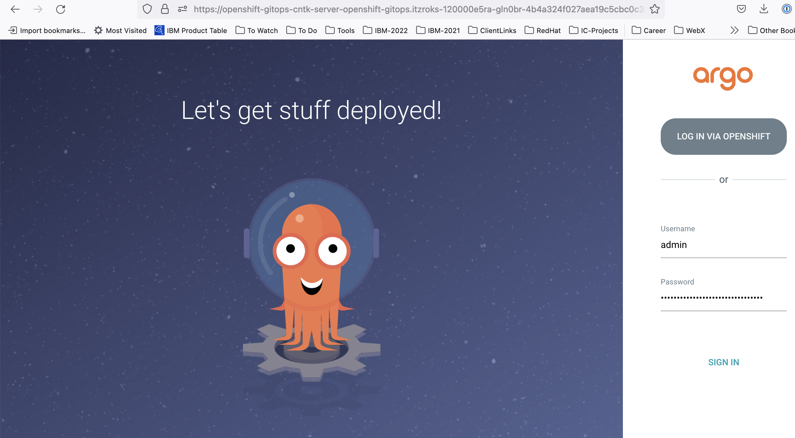

# GitOps Workshop Guide for **Sterling File Gateway/B2B Integrator**

## Overview  

<!--- cSpell:ignore gitorg YAMLs -->

The GitOps concept originated from [Weaveworks](https://www.weave.works/) back in 2017 and the goal was to automate the operations of a Kubernetes (K8s) system using a model external to the system as the source of truth ([History of GitOps](https://www.weave.works/blog/the-history-of-gitops)).

There are various GitOps structure and workflows.  This is our opinionated point of view (PoV) on how `GitOps` can be used to manage the infrastructure, services and application layers of K8s based systems.  It takes into account the various personas interacting with the system and accounts for separation of duties.

In this workshop you will learn the following: 
-   Overview of IBM's GitOps structure and workflow.  During the presentation in part one of the workshop, the instructors will present the overview of IBM's GitOps structure and workflow.  The information that is covered can be found in the [IBM GitOps Deployment Production guide](https://production-gitops.dev/gitops/structure/#gitops-principles).
-   IBM's GitOps Receipe for deploying IBM Sterling File Gateway/B2B Integrator.  During part two of this workshop presentation, the instructors will cover an overview of [IBM GitOps Receipe](https://github.com/cloud-native-toolkit/multi-tenancy-gitops/blob/master/doc/sfg-recipe.md) for deploying IBM Sterling File Gateway/B2B Integrator. 
-   Lab 1 - Deploy the IBM Sterling File Gateway/B2B Integrator using the [IBM GitOps Recipe](https://github.com/cloud-native-toolkit/multi-tenancy-gitops/blob/master/doc/sfg-recipe.md)
-   Lab 2 - Validating Use case Requirements for Self-Healing, Upgrade/Rollback and automatic Pod Scaling.

## Lab Prerequsites - Client Environment Setup 
This part of the workshop is a hands-on lab that the instructors will walk you through to deploy an instances of IBM Sterling File Gateway/B2B Integrator.  You will be assigned a RedHat OpenShift Environment and GitHub Organization in which to run the lab.  You will need to have your IBMId and Public GitHub ID that you provided to sign up for the lab available.  If you have any issues accessing the environment with you IBMId and GitHub ID, please consult with your lab instructor.

### Environment Assignment 
You should have received an e-mail from the IBM instructor with your assigned environment access based on your IBMid and GitHub Id. 

### Login and Setup the IBM Cloud Shell Environment

1. Access IBM Cloud shell and login to the [IBM Cloud Shell](https://cloud.ibm.com/shell)

2. Install and setup the prequiste CLIs 
```bash
mkdir bin
cd bin
wget https://github.com/bitnami-labs/sealed-secrets/releases/download/v0.17.4/kubeseal-0.17.4-linux-amd64.tar.gz
tar -xvf kubeseal-0.17.4-linux-amd64.tar.gz
chmod 755 kubeseal
export PATH=~/bin:$PATH
echo $PATH
```

3. Setup the environement variables
```bash
export GIT_ORG=#enter name for GitHub organization
echo $GIT_ORG #To validate that GIT_ORG has the correct value.
```
4. Clone your GitOps repositories from your Github Organization 
```bash
cd ~
mkdir $GIT_ORG
cd $GIT_ORG
git clone https://github.com/$GIT_ORG/multi-tenancy-gitops.git
git clone https://github.com/$GIT_ORG/multi-tenancy-gitops-infra.git
git clone https://github.com/$GIT_ORG/multi-tenancy-gitops-services.git
ls -l
```

5. Setup your GitHub profile
```bash
git config --global user.email "email@example.com"
git config --global user.name "Your Name"
```

6. Login to the RedHat Openshift Cluster
Log in to your cluster with your IBMid by browsing to the `OpenShift web console` (*see your environment assignment e-mail for the link to your ROKS Cluster URL*). From the dropdown menu in the upper right of the page, click Copy Login Command.  Paste the copied command in your IBM Cloud shell.

*Note that the shell session's [IBM Cloud Shell workspace](https://cloud.ibm.com/docs/cloud-shell?topic=cloud-shell-files#file-persistence) is deleted one hour after the shell session is closed.  If you loose the shell workspace, follow the steps above to re-setup the environment.*

---

## Lab 1 - Deploy the  IBM Sterling File Gateway/B2B Integrator using IBM's GitOps Recipe
----
1. Create your GitHub Personal Access Token and save it on your machine.  You will need it later when you push changes to the github repo. See the [steps for creating a GitHub Personal Access Token](github-pat-steps.md)

2. Lauch and login in to your Argo instance with the credentials provided in the environment e-mail you received from IBM TechZone.

 

 and verify the Argo applications 
 
 


### Deploy the Pre-Requisite Infrastructure Components 
In the first section of this lab, you will review the  `Infrastructure` layer in the [kustomization.yaml](https://github.com/cloud-native-toolkit/multi-tenancy-gitops/blob/master/0-bootstrap/single-cluster/1-infra/kustomization.yaml) file and un-comment the resources  based on the  [IBM SFG recipe](https://github.com/cloud-native-toolkit/multi-tenancy-gitops/blob/master/doc/sfg-recipe.md) as below.

### 1. Edit the Infrastructure layer - Kustomization.yaml file

Edit the Infrastructure layer `~/$GIT_ORG/multi-tenancy-gitops/0-bootstrap/single-cluster/1-infra/kustomization.yaml`, un-comment the following lines, commit and push the changes and synchronize the `infra` Application in the ArgoCD console.

#### Deploy the Kubernetes infrastructure level resources via the kustomization.yaml
by uncommented the `resources:` as you see below:

`vi ~/$GIT_ORG/multi-tenancy-gitops/0-bootstrap/single-cluster/1-infra/kustomization.yaml`
```Markdown
resources:
#- argocd/consolelink.yaml
- argocd/consolenotification.yaml
#- argocd/namespace-ibm-common-services.yaml
#- argocd/namespace-ci.yaml
#- argocd/namespace-dev.yaml
#- argocd/namespace-staging.yaml
#- argocd/namespace-prod.yaml
#- argocd/namespace-cloudpak.yaml
#- argocd/namespace-istio-system.yaml
#- argocd/namespace-openldap.yaml
- argocd/namespace-sealed-secrets.yaml
- argocd/namespace-tools.yaml
#- argocd/namespace-instana-agent.yaml
#- argocd/namespace-robot-shop.yaml
#- argocd/namespace-openshift-serverless.yaml
#- argocd/namespace-knative-eventing.yaml
#- argocd/namespace-knative-serving.yaml
#- argocd/namespace-knative-serving-ingress.yaml
#- argocd/namespace-openshift-storage.yaml
#- argocd/namespace-spp.yaml
#- argocd/namespace-spp-velero.yaml
#- argocd/namespace-baas.yaml
- argocd/namespace-db2.yaml
- argocd/namespace-mq.yaml
#- argocd/serviceaccounts-ibm-common-services.yaml
- argocd/serviceaccounts-tools.yaml
- argocd/serviceaccounts-db2.yaml
- argocd/serviceaccounts-mq.yaml
#- argocd/scc-wkc-iis.yaml
#- argocd/storage.yaml
#- argocd/infraconfig.yaml
#- argocd/machinesets.yaml
```

Now deploy these changes by committing and pushing the changes to your `multi-tenancy-gitops` repository:
```bash
# Verify the changes by with the following command
git diff

# Finally commit and push the changes
git commit -s -am "for now only deploy infrastructure resources"

git push
# Input your github username when prompted for Username
# Input the Github Token that you had created earlier when prompted for Password
```

Sync the changes in Argo at via the `infra` argo application
*** Need a picture here***


### 2. Install the Sealed Secret Service

Edit the Argo Services layer in the `multi-tenancy-gitops` **repo**  and install Sealed Secrets service by uncommenting the line below: 

`vi ~/$GIT_ORG/multi-tenancy-gitops/0-bootstrap/single-cluster/2-services/kustomization.yaml`
```Markdown
resources:

# Sealed Secrets
- argocd/instances/sealed-secrets.yaml

```

Now deploy the sealed-secrets service by committing and pushing the changes to your `multi-tenancy-gitops` repository:
```bash
# Verify the changes by with the following command
git diff

# Finally commit and push the changes
git commit -s -am "only deploy the sealed secret service"

git push
# Input your github username when prompted for Username
# Input the Github Token that you had created earlier when prompted for Password
```
Sync the changes in Argo via the service argo application

### 3. Generate Sealed Secrets and  Volume Storage Resources required by Sterling File Gateway

Now in the `multi-tenancy-gitops-service` **repo**, changed to the  B2B setup directory to generate the sealed secret and the volume storage deployment yaml files.
```bash
cd ~/$GIT_ORG/multi-tenancy-gitops-services/instances/ibm-sfg-b2bi-setup
```

#### Generate Sealed Secrets resources required by Sterling File Gateway.  
The following commands will generate the yaml resource files from a template and create the deployment yaml files to deploy the sealed secrets into the cluster.  Execute the following commands:

i. Generate a Sealed Secret for the DB2 credentials.
```bash
B2B_DB_SECRET=db2inst1 ./b2b-db-secret-secret.sh
```
ii. Generate a Sealed Secret for the MQ credentials, keystore and truststore password.
```bash
JMS_PASSWORD=password JMS_KEYSTORE_PASSWORD=password JMS_TRUSTSTORE_PASSWORD=password ./b2b-jms-secret.sh
```
iii. Generate a Sealed Secret for the B2B System Passphrase.
```bash
B2B_SYSTEM_PASSPHRASE_SECRET=password ./b2b-system-passphrase-secret.sh
```

#### Generate Persistent Volume Storage resources required by Sterling File Gateway. 
The following commands will generate the yaml resource files from a template and create the deployment yaml files to deploy the volume storage into the cluster.  Execute the commands:

```bash
./ibm-b2bi-documents-pv.sh
./ibm-b2bi-logs-pv.sh
./ibm-b2bi-resources-pv.sh
./sterlingtoolkit-pv.sh
```

ow deploy the generated resources changes by committing and pushing the changes to your `multi-tenancy-gitops-services` repository:
```bash
# Verify the changes by with the following command.  You should see new yaml files for the sealed secrets and volume storage yamls
git diff

# Finally commit and push the changes
git commit -s -am "deploy resources needed for service"

git push
# Input your github username when prompted for Username
# Input the Github Token that you had created earlier when prompted for Password
```

Now edit the Argo Services layer in the `multi-tenancy-gitops` **repo** by  uncommenting the following lines to deployed the sealed secrets and volume storage yamls required for Sterling File Gateway, **commit** and **push** the changes and synchronize the `services` Application in the ArgoCD console.

`vi ~/$GIT_ORG/multi-tenancy-gitops/0-bootstrap/single-cluster/2-services/kustomization.yaml`
```Markdown
resources:

# B2BI
- argocd/instances/ibm-sfg-db2.yaml
- argocd/instances/ibm-sfg-mq.yaml
- argocd/instances/ibm-sfg-b2bi-setup.yaml
#- argocd/instances/ibm-sfg-b2bi.yaml
```

Now deploy the generated resources changes by committing and pushing the changes to your `multi-tenancy-gitops` repository:
```bash
# Verify the changes by with the following command.  You should see new yaml files for the sealed secrets and volume storage yamls
git diff

# Finally commit and push the changes
git commit -s -am "deploy services resources"

git push
# Input your github username when prompted for Username
# Input the Github Token that you had created earlier when prompted for Password
```

Sync the changes in Argo  via the `service` argo application


### 4. Create the B2B Installation settings for deployment

Generate the installation settings in the `multi-tenancy-gitops-services` **repo**  by executing the following commands:

```bash
cd ~/$GIT_ORG/multi-tenancy-gitops-services/instances/ibm-sfg-b2bi
```

```bash
./ibm-sfg-b2bi-overrides-values.sh
```

Update the  **repo** by committing and pushing the changes to your `multi-tenancy-gitops-service` repository:
```bash
# Verify the changes by with the following command - new file values.yaml 
git diff

# Finally commit and push the changes
git commit -s -am "created the deployment settings via the values.yaml"

git push
# Input your github username when prompted for Username
# Input the Github Token that you had created earlier when prompted for Password
```

### 5. Deploy the IBM Sterling B2B Integrator 

Edit the Argo Services layer in the `multi-tenancy-gitops` **repo**  and install the IBM Sterling B2B Integrator Service 

`vi ~/$GIT_ORG/multi-tenancy-gitops/0-bootstrap/single-cluster/2-services/kustomization.yaml`
```Markdown
resources:

# B2BI
- argocd/instances/ibm-sfg-db2.yaml
- argocd/instances/ibm-sfg-mq.yaml
- argocd/instances/ibm-sfg-b2bi-setup.yaml
- argocd/instances/ibm-sfg-b2bi.yaml
```


Now deploy the IBM Sterling B2B Integrator Service   by committing and pushing the changes to your `multi-tenancy-gitops` repository:
```bash
# Verify the changes by with the following command - only the argocd/instances/ibm-sfg-b2bi.yaml was added
git diff

# Finally commit and push the changes
git commit -s -am "deploy the IBM Sterling B2B Integrator servcie"

git push
# Input your github username when prompted for Username
# Input the Github Token that you had created earlier when prompted for Password
```

Sync the changes in Argo  via the `service` argo application

**Note that the above sync will take approximately 1.5 hours as this part of the deployment generates the initial Sterling B2B Integrator database.**

Now verify the the Sterling File Gateway Console.  Retrieve the Sterling File Gateway console URL.
```bash
oc get route -n tools ibm-sfg-b2bi-sfg-asi-internal-route-filegateway -o template --template='https://{{.spec.host}}'
```
and login with the default credentials:  username:`fg_sysadmin` password: `password` 


### 6. Disable the Database Setup BEFORE Lab # 2. 

**Make Sure to DIASABLE the database generation before the next lab**. 

In  the `multi-tenancy-gitops-server` **repo**  turn off the database generation by editing the properties overide file `values.yaml` for the IBM Sterling B2B Integrator Service.  Execute the following:

```bash
cd ~/$GIT_ORG/multi-tenancy-gitops-services/instances/ibm-sfg-b2bi
```

`vi ~/$GIT_ORG/multi-tenancy-gitops-services/instances/ibm-sfg-b2bi/values.yaml`
```yaml
dataSetup:
    enable: false
dbCreateSchema: false
```

Now deploy the changes by committing and pushing the changes to your `multi-tenancy-gitops-services` repository:
```bash
# Verify the changes by with the following command.
git diff

# Finally commit and push the changes
git commit -s -am "disable the SFG database generation"

git push
# Input your github username when prompted for Username
# Input the Github Token that you had created earlier when prompted for Password
```

Sync the changes in Argo  via the `service` argo application

Now verify the the Sterling File Gateway Console.  Retrieve the Sterling File Gateway console URL.
```bash
oc get route -n tools ibm-sfg-b2bi-sfg-asi-internal-route-filegateway -o template --template='https://{{.spec.host}}'
```
and login with the default credentials:  username:`fg_sysadmin` password: `password` 

___

## Lab 2 - Validate the Use Cases for Self-Healing, Upgrade/Rollback and automatic Pod Scaling
The final part of the hands-on lab is to validate the three use cases (Self-Healing, Upgrade/RollBack, and Automatic Pod Scaling).

See the [use case instructions](./Scenarios.md) to complete final part of the workshnop.

---
