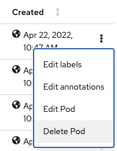

# B2Bi Foundational Capabilities 
### Proof Points
1. Self-healing
    - First Delete a pod.
         <!--  --> 
      
      
    - After pod is deleted, pod is reinstantiated and processing work as part of the deployed Sterling B2B Integrator cluster.
    >💡 **NOTE**     
    > While the pod is being terminated a new pod is being created.
    > Let say we kill one of the pods or it crashes.
    > Openshift will automatically create a new pod to replace the deleted pod
      
      
      
      
      
      
   

1. Upgrade/Rollback 
    - Shorten upgrade processes to lessen downtime.
    - If something goes wrong- then roll back to previous version.
    - Newly instantiated version is processing work as part of the deployed Sterling B2B Integrator cluster and subsequently reverted back to the earlier running version.
    - Let say We want to upgrade to a new fix pack.
    - Check the current version which is version 6.1.0.0. Now if we want to upgrade, we need to update the values.yaml file in git.

        

    - Upgrading the version from `6.1.0.0` to `6.1.0.1` 
    - The upgrade will remove and terminate pods from the previous version. 
    - Argocd will detect these changes and create a new pod with the latest version.

        
        
                

          

1. Horizontal Pod Autoscaling
    - Newly instantiated pod is processing work as a part of the deployed Sterling B2B Integrator cluster.
    - Dynamically scale based on load/peak processing 
    The app can scale up and down manually or automatically
    - This option gives the max number of pod and mini number of pods we want to create based on workload and CPU usage.
    - Let go to git and make changes on the values.yaml file.
    - Set the replicaCount: 2 and enable autoscaling to True for both asi and ac components
      minReplicas: 2
      maxReplicas: 4
      targetCPUUtilizationPercentage: 60
    - If a pod start using more than 60% of the allocated CPU is going to spin up a new pod
    
        
    - Next, If we look at the cluster, you will see the new asi and ac autoscaler.

        
        
    - Next option, Let say we want to change the targetCPUUtilizationPercentage: 20
    - Openshift will spin up another pod to the max of 4.
    - If we look at the cluster new pods are been spined up to the max of 4 

 
