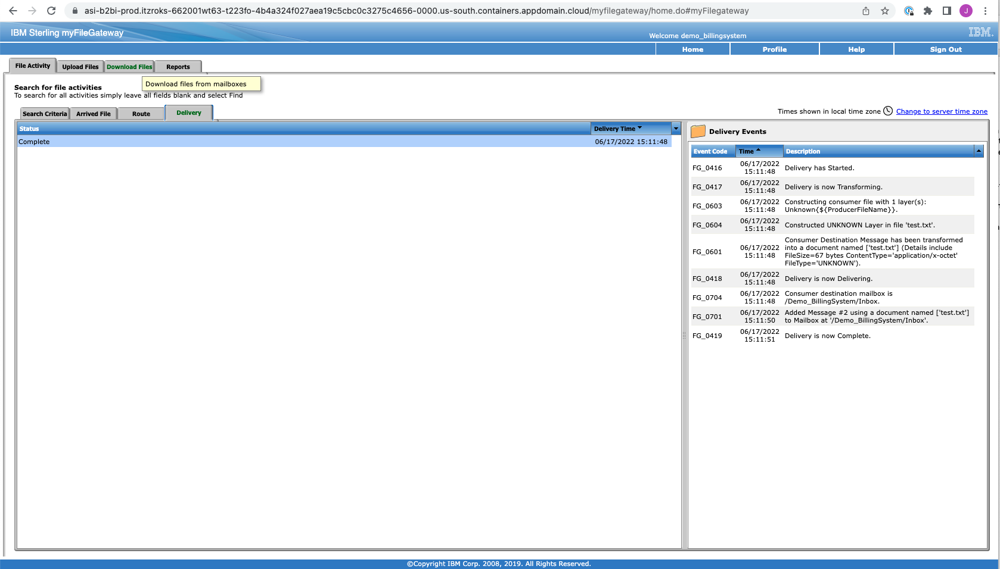

# B2Bi Capabilities - Use Case Requirements  

## 1. Self-healing

In this section of the lab, we see how RedHat OpenShift performs self healing when a pod is deleted. 

To delete the pod, login to your cluster with your IBMid by browsing to the `OpenShift web console` (*see your environment assignment e-mail for the link to your ROKS Cluster URL*).  From the administrator section menu on the left, clink on the `Workload` drop down menu and click on Pods, and at the top, select the `tools` project.  Select one of the `ibm-sfg-b2bi-sfg` pods to delete and end of the row, click the vertical dot menu and click delete. 

  

      
After the pod is deleted, the pod is reinstantiated and processing work as part of the deployed Sterling B2B Integrator cluster.

    >💡 **NOTE**     
    > While the pod is being terminated a new pod is being created.
    > If you delete on one of the pods or it crashes Openshift will automatically create a new pod to replace the problem pod
      
  
      
  

---

## 2. Upgrade/Rollback 

In this section of the lab, we see how you can upgrade and roll back versions using the GitOps method.

Using the GitOps method we see how the upgrade process is shorten.  We are also able to roll back to previous version if there is an issue.  The GitOps method also provides for traceability as to when and who made the change in the commit record in GitHub.

To upgrade the version, first go to the IBM Sterling Console application and check the current version, which is version `6.1.0.0`. 

  

Now go update the `values.yaml` file in your repo as follows:

- Step 1:
    ```bash
    cd ~/multi-tenancy-gitops-services/instances/ibm-sfg-b2bi
    ```
- Step 2: Inside `values.yaml`, find & set the tag from `6.1.0.0` to `6.1.0.1`
    ```yaml
  ibm-sfg-prod:
    global:
      image:
        repository: cp.icr.io/cp/ibm-sfg/sfg
        tag: 6.1.0.0          <--- change to 6.1.0.1       
    ```

Now deploy the changes by committing and pushing the changes to your `multi-tenancy-gitops-services` repository:
```bash
# Verify the changes by with the following command.
git diff

# Finally commit and push the changes
git commit -s -am "update to version 6.1.0.1"
git push https://github.com/[your github token]@[your github org name]/multi-tenancy-gitops-services.git
```
Sync the changes in Argo  via the `service` argo application

Argocd will detect these changes and create a new pod with the latest version.

  
        
         


To verify the version, simply go to the Sterling app menu and click on the support button in the Sterling Console.   
   


---

## 3. Horizontal Pod Autoscaling

In this section of the lab, we see how Horizontal Pod Autoscaling works in the OpenShift cluster.  We will see how the Sterling B2B Integrator instaance dynamically scales based on the load on the system.  For this lab we will simulate the load on the system by modifing the deployment paramaters via the GitOps repo.    Sterling B2B Integrator can scale up and down manually or automatically.

The deployments settings below affect the load, which are the number of pods and the CPU usage. 

Before we change the settings to simulate the load,  we will increse the relicca to 2 and enable autoscaling.  Follow the steps below:

  - Step 1:
    ```bash
    cd ~/multi-tenancy-gitops-services/instances/ibm-sfg-b2bi
    ```
  - Step 2: Inside `values.yaml`, find & set the `replicaCount` and `enabled` fields for both the `asi` and `ac` Sterling componets:

    ```yaml
    asi:
      replicaCount: 1   <--- change to 2
      ....
      autoscaling:
        enabled: false  <----change to true
        minReplicas: 2
        maxReplicas: 4
        targetCPUUtilizationPercentage: 60
    ```
    ```yaml
    ac:
      replicaCount: 1   <--- change to 2
      ....
      autoscaling:
        enabled: false  <----change to true
        minReplicas: 2
        maxReplicas: 4
        targetCPUUtilizationPercentage: 60
    ```
      
Now deploy the changes by committing and pushing the changes to your `multi-tenancy-gitops-services` repository:
```bash
# Verify the changes by with the following command.
git diff

# Finally commit and push the changes
git commit -s -am "increase replicas and enable auto scaling"
git push https://github.com/[your github token]@[your github org name]/multi-tenancy-gitops-services.git
```

Sync the changes in Argo  via the `service` argo application

Now, to simulate a load on the system so that we trigger the auto scaling of pods, we will lower the target CPU utiliziation by modifying the `values.yaml` file in GitOps repo.    Follow the steps below:
- Step 1:
    ```bash
    cd ~/multi-tenancy-gitops-services/instances/ibm-sfg-b2bi
    ```
  - Step 2: Inside `values.yaml`, find & set the `replicaCount` and `enabled` fields for both the `asi` and `ac` Sterling componets:

    ```yaml
    asi:
      replicaCount: 2   
      ....
      autoscaling:
        enabled: true  
        minReplicas: 2
        maxReplicas: 4
        targetCPUUtilizationPercentage: 60  <----change to 20
    ```
    ```yaml
    ac:
      replicaCount: 2 
      ....
      autoscaling:
        enabled: true  
        minReplicas: 2
        maxReplicas: 4
        targetCPUUtilizationPercentage: 60   <----change to 20
    ```
      
Now deploy the changes by committing and pushing the changes to your `multi-tenancy-gitops-services` repository:
```bash
# Verify the changes by with the following command.
git diff

# Finally commit and push the changes
git commit -s -am "lower the target CPU utlization to simulate load."
git push https://github.com/[your github token]@[your github org name]/multi-tenancy-gitops-services.git
```

Sync the changes in Argo via the `service` argo application

Now go to the Redhat Openshift Console and observe the number of pods for the `asi` and `ac` Sterling componets. 

  - If a pod starts using more than 20% of the allocated CPU the autoscaler is going to spin up a new pod
    
      
  
  - Next, go to the Openshift console and on the left go to the drop down and search under HorizontalPodAutoscaler, you will see the new `asi` and `ac` autoscalers.

---

## 4. Managed File Transfer

In this section of the lab, we see how a trading partner can send a file using managed file transfer with Sterling File Gateway (SFG, part of Sterling B2B Integrator). We will see how, using mailboxes, trading partners can easily send files to/from each other.

Before we can upload a file from a trading partner, we need to setup all the necessary configurations first. We will configure the Partners, Template, and Channel to facilitate the transfer of a test file.

  - Step 1: login to Sterling File Gateway as admin fg_sysadmin (go to https://route-to-asi/filegateway):

    
      


  - Step 2: create a new routing channel template named Demo_PassThrough with the following configuration:

    
      
  
      
  
      
  
      
  
      
  
      
  
      
  
      
  
      
  
      
  
      
  
      At the end, the new routing channel template should look as follows:

      
  
  - Step 3: create the trading partners that will participate in the managed file transfer transaction:

      First, create a new community named Billing where the participants will be a member of (this is required):

      

      

      

      

      

      

      Now, create the participant partners:

      

      

      First, create the internal partner Demo_BillingSystem that will be receiving the file (the Consumer):

      

      

      

      

      

      

      

      Next, create the external partner Demo_DrJohnDoe that will be sending the file (the Producer):

      

      

      

      

      

      

      

      

  - Step 4: create the routing the channel between the two trading partners using the channel template created earlier:

      Go to the menu: Routes -> Channels and define the producer and consumer as follows:

      

      

      

      

  - Step 5: login to Sterling My File Gateway as user demo_drjohndoe and upload the test file (go to https://route-to-asi/myfilegateway):

      

     Copy or create the [test.txt](samples/test.txt) file and upload as follows:
      
      

      

      

  - Step 6: as an admin, check if the file routed successfully from producer to consumer, by logging in to Sterling File Gateway as fg_sysadmin (go to https://route-to-asi/filegateway):

      

      

      

      

      

      

  - Step 7: login to Sterling My File Gateway as user demo_billingsystem and open the received test file (go to https://route-to-asi/myfilegateway):

      

      

      

      

      

      

      

      


